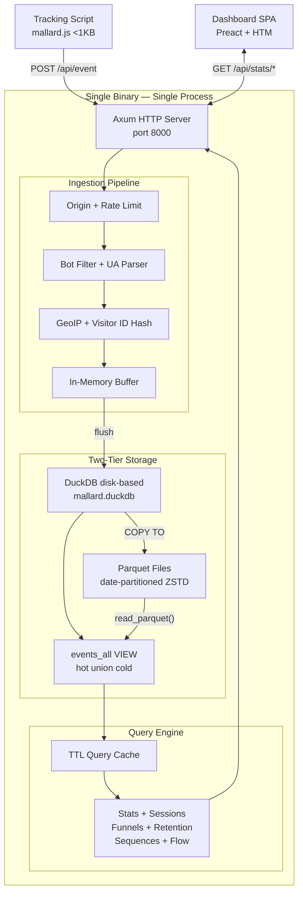

# Mallard Metrics

> **Self-hosted, privacy-focused web analytics powered by DuckDB and the `behavioral` extension.**
> Single binary. Single process. Zero external dependencies.

[](#development)
[](https://www.rust-lang.org)
[](LICENSE)
[](#development)
[](#privacy-by-design)
[](https://tomtom215.github.io/mallardmetrics)

A lightweight, privacy-respecting alternative to Plausible Analytics. Runs entirely on your infrastructure — no third-party services, no cookies, no persistent IP storage. See [PRIVACY.md](PRIVACY.md) for the complete data-processing architecture and operator compliance guidance.

---

## Table of Contents

- [Features](#features)
- [Quick Start](#quick-start)
- [Tracking Script](#tracking-script)
- [Configuration](#configuration)
- [API Reference](#api-reference)
- [Architecture](#architecture)
- [Dashboard](#dashboard)
- [Technology Stack](#technology-stack)
- [Development](#development)
- [Deployment](#deployment)
- [Documentation](#documentation)
- [License](#license)

---

## Features

### Privacy by Design

- **No cookies** — Visitor identification uses a daily-rotating HMAC-SHA256 hash of IP + User-Agent + daily salt; no cookies are set and no browser storage is accessed
- **No persistent IP storage** — IP addresses are processed ephemerally in RAM (for GeoIP lookup and visitor ID derivation) and never written to disk or logs
- **Daily salt rotation** — Visitor IDs change every 24 hours; the same IP + User-Agent produces a different hash on different days, preventing cross-day tracking
- **Pseudonymous, not anonymous** — Stored visitor IDs are HMAC-SHA256 hashes; pseudonymous data is still personal data under GDPR Recital 26. Geographic data (country, region, city) derived from IP is stored. See [PRIVACY.md](PRIVACY.md) for the full analysis and operator obligations.

### Single Binary Deployment

- **One process** handles ingestion, storage, querying, authentication, and the dashboard
- **Zero external dependencies** — DuckDB is embedded; no separate database to install or manage
- **`FROM scratch` Docker image** — Static musl binary with no runtime dependencies
- **WAL durability** — DuckDB disk-based storage survives crashes without data loss

### Analytical Power

- **Core metrics** — Unique visitors, pageviews, bounce rate, average session duration
- **Breakdowns** — Pages, referrer sources, browsers, operating systems, devices, countries
- **Time-series** — Hourly and daily aggregations with chart visualization
- **Funnel analysis** — Multi-step conversion funnels via `window_funnel()`
- **Retention cohorts** — Weekly cohort retention grids via `retention()`
- **Session analytics** — Session duration, pages per session via `sessionize()`
- **Sequence matching** — Behavioral pattern detection via `sequence_match()`
- **Flow analysis** — Next-page navigation patterns via `sequence_next_node()`

### GDPR-Friendly Deployment

Mallard Metrics ships a first-class GDPR mode that reduces data collection to the minimum needed for aggregate analytics:

| Setting | Standard | GDPR Mode |
|---|---|---|
| Visitor ID | HMAC-SHA256 pseudonymous hash | HMAC-SHA256 (suppress with `suppress_visitor_id`) |
| Referrer | Full URL with query string | Path only — query and fragment stripped |
| Timestamps | Millisecond precision | Rounded to nearest hour |
| Browser info | Name + version | Name only |
| OS info | Name + version | Name only |
| Screen / device | Stored | Omitted |
| GeoIP | City-level | Country-level only |

Enable with a single environment variable (`MALLARD_GDPR_MODE=true`) or configure each flag independently. A `DELETE /api/gdpr/erase` endpoint supports GDPR Art. 17 right-to-erasure requests. See [PRIVACY.md](PRIVACY.md) for the full compliance analysis and operator obligations.

### Production Ready

- **Argon2id authentication** — Password-protected dashboard with cryptographic session tokens
- **API key management** — Programmatic access with SHA-256 hashed keys (`mm_` prefix, disk-persisted)
- **Rate limiting** — Per-site token-bucket rate limiter for ingestion
- **Query caching** — TTL-based in-memory cache for analytics queries
- **Bot filtering** — Automatic filtering of known bot User-Agents
- **GeoIP resolution** — MaxMind GeoLite2 integration with graceful fallback
- **Data retention** — Configurable automatic cleanup of old Parquet partitions
- **Graceful shutdown** — Buffered events are flushed before process exit
- **Prometheus metrics** — `GET /metrics` endpoint with counters for ingestion, cache, auth, and rate limiting
- **Security headers** — OWASP-recommended headers including HSTS, CSP, and Permissions-Policy
- **CSRF protection** — Origin/Referer validation on all state-mutating endpoints
- **Brute-force protection** — Per-IP login lockout with configurable thresholds

---

## Quick Start

### Docker (recommended)

```bash
docker run -d \
  -p 127.0.0.1:8000:8000 \
  -v mallard-data:/data \
  -e MALLARD_SECRET=your-random-32-char-secret \
  -e MALLARD_ADMIN_PASSWORD=your-dashboard-password \
  ghcr.io/tomtom215/mallard-metrics
```

### Docker Compose

```bash
docker compose up -d
```

The default `docker-compose.yml` includes persistent storage, restart policy, and environment variable configuration. Set `MALLARD_SECRET` and `MALLARD_ADMIN_PASSWORD` in your environment for production.

### From Source

```bash
# Requires Rust 1.93.0+ (set automatically via rust-toolchain.toml)
cargo build --release
./target/release/mallard-metrics
```

Visit `http://localhost:8000` to access the dashboard. On first visit you will be prompted to set an admin password.

---

## Tracking Script

Add the following snippet to every page you want to track:

```html
<script defer data-domain="yourdomain.com"
  src="https://your-mallard-instance.com/mallard.js"></script>
```

### Custom Events and Revenue Tracking

The tracking script exposes `window.mallard()` for custom event tracking:

```javascript
// Track a custom event
window.mallard('signup', {
  props: { plan: 'pro', source: 'landing-page' }
});

// Track revenue
window.mallard('purchase', {
  revenue: 49.99,
  currency: 'USD',
  props: { product: 'annual-plan' },
  callback: () => console.log('tracked')
});
```

| Parameter  | Type     | Description                        |
|------------|----------|------------------------------------|
| `props`    | Object   | Custom properties (max 4096 chars) |
| `revenue`  | Number   | Revenue amount                     |
| `currency` | String   | ISO 4217 currency code             |
| `callback` | Function | Called after the event is sent     |

The tracking script is under 1 KB minified and has zero external dependencies.

---

## Configuration

Mallard Metrics is configured via a TOML file, environment variables, or both. Environment variables override TOML values.

```bash
./mallard-metrics /path/to/mallard-metrics.toml
```

See [`mallard-metrics.toml.example`](mallard-metrics.toml.example) for a fully documented configuration template.

### Key Environment Variables

| Variable | Default | Description |
|---|---|---|
| `MALLARD_HOST` | `0.0.0.0` | Server bind address |
| `MALLARD_PORT` | `8000` | Server listen port |
| `MALLARD_DATA_DIR` | `data` | Directory for Parquet data and DuckDB file |
| `MALLARD_SECRET` | (random) | HMAC key for visitor ID hashing. **Set for production** to persist visitor IDs across restarts |
| `MALLARD_ADMIN_PASSWORD` | (none) | Admin password for dashboard authentication |
| `MALLARD_SECURE_COOKIES` | `false` | Enable `Secure` flag on session cookies (required when behind TLS) |
| `MALLARD_METRICS_TOKEN` | (none) | Bearer token protecting the `/metrics` endpoint |
| `MALLARD_FLUSH_COUNT` | `1000` | Events buffered before flushing to disk |
| `MALLARD_FLUSH_INTERVAL` | `60` | Seconds between periodic buffer flushes |
| `MALLARD_GEOIP_DB` | (none) | Path to MaxMind GeoLite2-City.mmdb |
| `MALLARD_DASHBOARD_ORIGIN` | (none) | Restrict dashboard CORS to this origin (enables CSRF protection) |
| `MALLARD_FILTER_BOTS` | `true` | Filter known bot User-Agents |
| `MALLARD_RETENTION_DAYS` | `0` | Auto-delete data older than N days (0 = unlimited) |
| `MALLARD_RATE_LIMIT` | `0` | Max events/sec per site (0 = unlimited) |
| `MALLARD_CACHE_TTL` | `60` | Query cache TTL in seconds |
| `MALLARD_LOG_FORMAT` | `text` | Log format: `text` or `json` |
| `MALLARD_GDPR_MODE` | `false` | Enable GDPR-friendly preset (see [PRIVACY.md](PRIVACY.md)) |
| `MALLARD_STRIP_REFERRER_QUERY` | `false` | Strip `?query` and `#fragment` from stored referrers |
| `MALLARD_ROUND_TIMESTAMPS` | `false` | Round event timestamps to the nearest hour |
| `MALLARD_SUPPRESS_VISITOR_ID` | `false` | Replace HMAC visitor hash with per-request UUID (breaks unique-visitor counting) |
| `MALLARD_SUPPRESS_BROWSER_VERSION` | `false` | Store browser name only, not version |
| `MALLARD_SUPPRESS_OS_VERSION` | `false` | Store OS name only, not version |
| `MALLARD_SUPPRESS_SCREEN_SIZE` | `false` | Omit screen width and device type |
| `MALLARD_GEOIP_PRECISION` | `city` | GeoIP precision: `city`, `region`, `country`, or `none` |

---

## API Reference

All `/api/stats/*`, `/api/keys/*`, and `/api/stats/export` endpoints require authentication (session cookie or API key). The ingestion endpoint and health checks are unauthenticated.

### Common Query Parameters

| Parameter | Default | Description |
|---|---|---|
| `site_id` | (required) | Analytics property identifier |
| `period` | `30d` | Time period: `day`, `today`, `7d`, `30d`, `90d` |
| `start_date` | (none) | Explicit start date (YYYY-MM-DD) |
| `end_date` | (none) | Explicit end date (YYYY-MM-DD) |
| `limit` | `10` | Result limit (breakdowns only, max 1000) |

### Endpoints

#### Health and Monitoring

| Method | Endpoint | Description |
|---|---|---|
| GET | `/health` | Liveness check (returns `ok`) |
| GET | `/health/ready` | Readiness probe — queries DuckDB; returns 503 if not ready |
| GET | `/health/detailed` | JSON system status (version, buffer, auth, GeoIP, behavioral extension, cache) |
| GET | `/metrics` | Prometheus metrics (`text/plain; version=0.0.4`) |
| GET | `/robots.txt` | Crawler policy |
| GET | `/.well-known/security.txt` | RFC 9116 security contact |

#### Authentication

| Method | Endpoint | Description |
|---|---|---|
| POST | `/api/auth/setup` | First-run admin password setup |
| POST | `/api/auth/login` | Login with credentials |
| POST | `/api/auth/logout` | Logout and clear session |
| GET | `/api/auth/status` | Check authentication status |

#### Ingestion

| Method | Endpoint | Description |
|---|---|---|
| POST | `/api/event` | Ingest a tracking event (permissive CORS, 64 KB body limit) |
| GET | `/api/event` | Pixel tracking — same parameters via query string; returns 1×1 GIF |

#### Core Analytics (authenticated)

| Method | Endpoint | Description |
|---|---|---|
| GET | `/api/stats/main` | Unique visitors, pageviews, bounce rate, avg session duration |
| GET | `/api/stats/timeseries` | Time-bucketed visitor and pageview counts |
| GET | `/api/stats/breakdown/{dim}` | Breakdown by: `pages`, `sources`, `browsers`, `os`, `devices`, `countries` |

#### Advanced Analytics (authenticated, requires `behavioral` extension)

| Method | Endpoint | Parameters | Description |
|---|---|---|---|
| GET | `/api/stats/sessions` | — | Session metrics (total, avg duration, pages/session) |
| GET | `/api/stats/funnel` | `steps`, `window` | Multi-step conversion funnel |
| GET | `/api/stats/retention` | `weeks` (1–52) | Weekly retention cohort grid |
| GET | `/api/stats/sequences` | `steps` (min: 2) | Behavioral sequence pattern matching |
| GET | `/api/stats/flow` | `page` | Next-page flow analysis |

#### Data Management (authenticated)

| Method | Endpoint | Description |
|---|---|---|
| GET | `/api/stats/export` | Export analytics data (`format=csv` or `format=json`) |
| DELETE | `/api/gdpr/erase` | Erase all events for a site within a date range (Art. 17 erasure) |
| POST | `/api/keys` | Create an API key |
| GET | `/api/keys` | List all API keys |
| DELETE | `/api/keys/{hash}` | Revoke an API key |

---

## Architecture



### Module Map

| Module | Purpose |
|---|---|
| `config.rs` | TOML + environment variable configuration |
| `server.rs` | Axum router, middleware stack, route registration |
| `ingest/handler.rs` | `POST /api/event` ingestion handler |
| `ingest/buffer.rs` | In-memory event buffer with periodic flush |
| `ingest/visitor_id.rs` | HMAC-SHA256 privacy-safe visitor ID generation |
| `ingest/useragent.rs` | User-Agent parsing (browser, OS, version, device) |
| `ingest/geoip.rs` | MaxMind GeoLite2 reader with graceful fallback |
| `ingest/ratelimit.rs` | Per-site token-bucket rate limiter |
| `storage/schema.rs` | DuckDB table definitions, `events_all` view, behavioral extension loading |
| `storage/parquet.rs` | Parquet write, read, and date-partitioning |
| `storage/migrations.rs` | Schema versioning |
| `query/metrics.rs` | Core metric calculations (visitors, pageviews, bounce rate) |
| `query/breakdowns.rs` | Dimension breakdown queries |
| `query/timeseries.rs` | Time-bucketed aggregations |
| `query/sessions.rs` | `sessionize()`-based session queries |
| `query/funnel.rs` | `window_funnel()` conversion funnel builder |
| `query/retention.rs` | `retention()` cohort query execution |
| `query/sequences.rs` | `sequence_match()` pattern query execution |
| `query/flow.rs` | `sequence_next_node()` flow analysis |
| `query/cache.rs` | TTL-based query result cache |
| `api/stats.rs` | All analytics API handlers |
| `api/errors.rs` | API error types and HTTP responses |
| `api/auth.rs` | Origin validation, session auth, API key management |
| `dashboard/` | Embedded SPA (Preact + HTM, no build step) |

---

## Dashboard

The dashboard is a single-page application built with Preact + HTM, embedded directly in the binary via `rust-embed`. No build step or Node.js required.

**Views include:**

- Visitor and pageview counts with period selector
- Time-series line chart (visitors and pageviews)
- Six breakdown tables (pages, sources, browsers, OS, devices, countries)
- Session analytics cards (total sessions, avg duration, pages/session)
- Funnel analysis visualization (horizontal bar chart)
- Retention cohort grid (weekly cohort boolean matrix)
- Sequence matching conversion metrics
- Flow analysis (next-page navigation table)
- CSV and JSON export buttons

---

## Technology Stack

| Component | Technology | Version |
|---|---|---|
| Language | Rust | 1.93.0 (MSRV) |
| Web Framework | Axum | 0.8 |
| Database | DuckDB (disk-based, embedded) | 1.4.4 |
| Analytics Engine | `behavioral` extension | runtime-loaded |
| Storage Format | Parquet (ZSTD compressed) | date-partitioned |
| Frontend | Preact + HTM | no build step |
| Password Hashing | Argon2id | `argon2` 0.5 |
| GeoIP | MaxMind GeoLite2 | `maxminddb` 0.27 |
| Deployment | Static musl binary | `FROM scratch` Docker |

---

## Development

### Prerequisites

- Rust 1.93.0+ (managed automatically via `rust-toolchain.toml`)
- Git

### Build and Test

```bash
# Build
cargo build

# Run all tests (333 total: 262 unit + 71 integration)
cargo test

# Clippy (zero warnings required)
cargo clippy --all-targets

# Format check
cargo fmt -- --check

# Build documentation
cargo doc --no-deps

# Run the server
cargo run

# Run benchmarks
cargo bench
```

### Quality Standards

- **Zero clippy warnings** — pedantic, nursery, and cargo lint groups enabled
- **Zero formatting violations** — enforced via `cargo fmt`
- **All 333 tests pass** — no ignored tests
- **Documentation builds without errors**

See [CONTRIBUTING.md](CONTRIBUTING.md) for the full development workflow.

---

## Deployment

### Docker Compose (recommended for production)

Create a `.env` file (do not commit to source control):

```bash
MALLARD_SECRET=your-random-32-char-secret
MALLARD_ADMIN_PASSWORD=your-strong-dashboard-password
MALLARD_SECURE_COOKIES=true
MALLARD_METRICS_TOKEN=your-prometheus-bearer-token
```

Then start:

```bash
docker compose up -d
```

### Reverse Proxy (nginx)

```nginx
server {
    listen 443 ssl;
    server_name analytics.example.com;

    ssl_certificate     /etc/ssl/certs/analytics.example.com.crt;
    ssl_certificate_key /etc/ssl/private/analytics.example.com.key;

    location / {
        proxy_pass http://127.0.0.1:8000;
        proxy_set_header Host              $host;
        proxy_set_header X-Forwarded-For  $proxy_add_x_forwarded_for;
        proxy_set_header X-Forwarded-Proto $scheme;
        proxy_set_header X-Real-IP        $remote_addr;
    }
}
```

### GeoIP Setup (optional)

1. Register for a free MaxMind account at [maxmind.com](https://www.maxmind.com/en/geolite2/signup)
2. Download the GeoLite2-City database (`.mmdb` format)
3. Set `MALLARD_GEOIP_DB=/path/to/GeoLite2-City.mmdb`

If the GeoIP database is missing, country/region/city fields are stored as `NULL`. The system degrades gracefully — no errors are raised.

---

## Documentation

| Document | Description |
|---|---|
| **[GitHub Pages](https://tomtom215.github.io/mallardmetrics)** | Full documentation site — API reference, architecture, deployment, security |
| [PRIVACY.md](PRIVACY.md) | Data-processing architecture, GDPR/ePrivacy/CCPA analysis, operator compliance obligations |
| [CONTRIBUTING.md](CONTRIBUTING.md) | Development setup, workflow, code standards, PR checklist |
| [SECURITY.md](SECURITY.md) | Security model, privacy guarantees, threat model, vulnerability reporting |
| [CHANGELOG.md](CHANGELOG.md) | Version history following Keep a Changelog format |
| [ROADMAP.md](ROADMAP.md) | Implementation phases, completed work, and future plans |
| [PERF.md](PERF.md) | Benchmark framework, methodology, and measured baselines |
| [LESSONS.md](LESSONS.md) | 21 development lessons learned, organized by category |
| [CLAUDE.md](CLAUDE.md) | AI session protocol, module map, and development log |
| [mallard-metrics.toml.example](mallard-metrics.toml.example) | Annotated configuration template |

---

## License

AGPL-3.0 — see [LICENSE](LICENSE) for the full text.

Mallard Metrics is free software: you can redistribute it and/or modify it under the terms of the GNU Affero General Public License as published by the Free Software Foundation, version 3.
