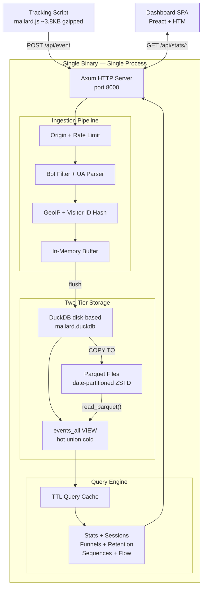
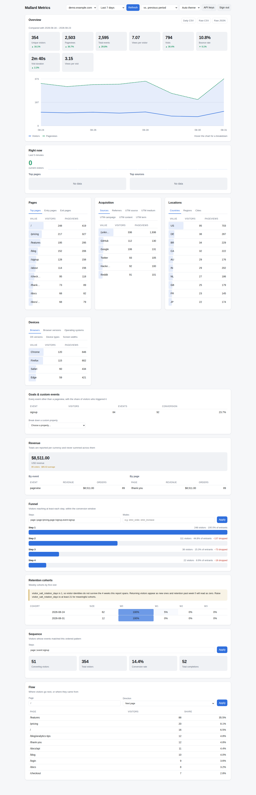

# Mallard Metrics

> **Self-hosted, privacy-focused web analytics powered by DuckDB and the `behavioral` extension.**
> Single binary. Single process. Zero external dependencies.

[](#development)
[](https://www.rust-lang.org)
[](LICENSE)
[](#development)
[](#privacy-by-design)
[](https://tomtom215.github.io/mallardmetrics)

A lightweight, privacy-respecting alternative to Plausible Analytics. Runs entirely on your infrastructure — no third-party services, no cookies, no persistent IP storage. See [PRIVACY.md](PRIVACY.md) for the complete data-processing architecture and operator compliance guidance.

---

## Table of Contents

- [Features](#features)
- [Quick Start](#quick-start)
- [Tracking Script](#tracking-script)
- [Configuration](#configuration)
- [API Reference](#api-reference)
- [Architecture](#architecture)
- [Dashboard](#dashboard)
- [Technology Stack](#technology-stack)
- [Development](#development)
- [Deployment](#deployment)
- [Documentation](#documentation)
- [License](#license)

---

## Features

### Privacy by Design

- **No cookies** — Visitor identification is an HMAC-SHA256 of site + IP + User-Agent under a rotating salt; no cookies are set and no browser storage is written
- **No persistent IP storage** — IP addresses are used in RAM for the GeoIP lookup and the visitor-ID derivation, then discarded; no IP is ever written to the event store. The one exception is deliberate and not on the analytics path: authentication events log a *truncated* address (IPv4 `/24`, IPv6 `/48`) so an operator can investigate an attack on the dashboard
- **Rotating salt** — Visitor IDs change when the salt rotates (every 24 hours by default), so the same IP and User-Agent hash differently on different days
- **Per-site scoping** — The site ID is part of the hash input, so one person visiting two sites on the same instance is not correlatable across them
- **Pseudonymous, not anonymous** — Stored visitor IDs are hashes, and pseudonymous data is still personal data under GDPR Recital 26. Geographic data derived from IP is stored. See [PRIVACY.md](PRIVACY.md) for the full analysis and operator obligations.

> **Salt rotation has an analytical cost.** With the default daily rotation, a
> visitor seen on two days carries two unrelated IDs. "Unique visitors" over a
> multi-day range therefore counts visitor-days rather than people, and weekly
> retention cohorts cannot work at all. Raise `visitor_salt_rotation_days` if you
> need cross-day analysis, and read the trade-off in [PRIVACY.md](PRIVACY.md).

### Single Binary Deployment

- **One process** handles ingestion, storage, querying, authentication, and the dashboard
- **Zero external dependencies** — DuckDB is embedded; no separate database to install or manage
- **`FROM scratch` Docker image** — Static musl binary with no runtime dependencies
- **WAL durability** — DuckDB disk-based storage survives crashes without data loss

### Analytical Power

- **Core metrics** — Unique visitors, pageviews, events, visits, bounce rate, visit duration
- **Realtime** — Current visitors, top pages and sources, with a per-minute series
- **Twenty breakdown dimensions** — Pages, entry and exit pages, referrers and sources, all five UTM parameters, countries, regions, cities, browsers and versions, operating systems and versions, device types, screen widths, and event names
- **Segment filters** — `filters=countries==DE;devices!=mobile` narrows every figure a request returns, not just the breakdown you were looking at. Dimension names are the breakdown slugs, so clicking a row in the dashboard filters everything to it
- **Goals and custom properties** — Conversion rates for every custom event, and drill-down into the properties attached to them
- **Revenue** — Totals, order counts and average order value, reported per currency and never summed across them
- **Time-series** — Hourly and daily aggregation, gap-filled so a quiet day reads as zero rather than vanishing
- **Funnel analysis** — Cumulative multi-step funnels with drop-off, via `window_funnel()`, including its six ordering modes
- **Retention cohorts** — Weekly cohorts with retained counts and rates, via `retention()`
- **Session analytics** — Visits, duration and bounce rate, via `sessionize()`
- **Sequence matching** — Ordered pattern detection via `sequence_match()` and `sequence_count()`
- **Flow analysis** — Where visitors go next *and* where they came from, via `sequence_next_node()`
- **Export** — Daily summaries or raw events, as CSV or JSON

### GDPR-Friendly Deployment

Mallard Metrics ships a first-class GDPR mode that reduces data collection to the minimum needed for aggregate analytics:

| Setting | Standard | GDPR Mode |
|---|---|---|
| Visitor ID | HMAC-SHA256 pseudonymous hash | HMAC-SHA256 (suppress with `suppress_visitor_id`) |
| Referrer | Full URL with query string | Path only — query and fragment stripped |
| Timestamps | Microsecond precision | Rounded down to the hour |
| Browser info | Name + version | Name only |
| OS info | Name + version | Name only |
| Screen / device | Stored | Omitted |
| GeoIP | City-level | Country-level at most |

Enable with a single environment variable (`MALLARD_GDPR_MODE=true`) or configure each flag independently. A `DELETE /api/gdpr/erase` endpoint supports GDPR Art. 17 right-to-erasure requests. See [PRIVACY.md](PRIVACY.md) for the full compliance analysis and operator obligations.

### Production Ready

- **Argon2id authentication** — Password-protected dashboard with cryptographic session tokens
- **API key management** — Programmatic access with SHA-256 hashed keys (`mm_` prefix, disk-persisted)
- **Rate limiting** — Per-site and per-client-IP token-bucket limiters, both bounded
- **Query caching** — TTL cache with LRU eviction, applied to every read endpoint
- **Bot filtering** — Automatic filtering of known bot User-Agents
- **GeoIP resolution** — MaxMind GeoLite2 integration with graceful fallback
- **Data retention** — Configurable automatic cleanup of old Parquet partitions
- **Graceful shutdown** — Buffered events are flushed before process exit
- **Prometheus metrics** — `GET /metrics` endpoint with counters for ingestion, cache, auth, and rate limiting
- **Security headers** — OWASP-recommended headers including HSTS, CSP, and Permissions-Policy
- **CSRF protection** — Origin/Referer validation on all state-mutating endpoints
- **Brute-force protection** — Per-IP lockout on both login and first-time setup
- **Bounded memory** — The event buffer, session store, rate-limiter buckets and login-attempt records all have configurable caps
- **Atomic writes** — Parquet files, the API-key store and the visitor-ID secret are written to a temporary file and renamed into place; the secret files are mode 0600
- **Parquet compaction** — Small per-flush files are merged so scan cost does not grow with uptime
- **Read connection pool** — Analytics queries run on their own DuckDB connections, so a slow dashboard query cannot block ingestion

---

## Quick Start

### Docker (recommended)

```bash
docker run -d \
  -p 127.0.0.1:8000:8000 \
  -v mallard-data:/data \
  -e MALLARD_SECRET=your-random-32-char-secret \
  -e MALLARD_ADMIN_PASSWORD=your-dashboard-password \
  ghcr.io/tomtom215/mallard-metrics
```

### Docker Compose

```bash
docker compose up -d
```

The default `docker-compose.yml` includes persistent storage, restart policy, and environment variable configuration. Set `MALLARD_SECRET` and `MALLARD_ADMIN_PASSWORD` in your environment for production.

### From Source

```bash
# Requires Rust 1.98.0 (installed automatically via rust-toolchain.toml)
cargo build --release
./target/release/mallard-metrics
```

Visit `http://localhost:8000` to access the dashboard. On first visit you will be prompted to set an admin password.

---

## Tracking Script

Add the following snippet to every page you want to track:

```html
<script defer data-domain="yourdomain.com"
  src="https://your-mallard-instance.com/mallard.js"></script>
```

### Custom Events and Revenue Tracking

The tracking script exposes `window.mallard()` for custom event tracking:

```javascript
// Track a custom event
window.mallard('signup', {
  props: { plan: 'pro', source: 'landing-page' }
});

// Track revenue
window.mallard('purchase', {
  revenue: 49.99,
  currency: 'USD',
  props: { product: 'annual-plan' },
  callback: () => console.log('tracked')
});
```

| Parameter  | Type     | Description                        |
|------------|----------|------------------------------------|
| `props`    | Object   | Custom properties (max 4096 chars) |
| `revenue`  | Number   | Revenue amount                     |
| `currency` | String   | ISO 4217 currency code             |
| `callback` | Function | Called after the event is sent     |

The tracking script is about 3.8 KB gzipped, has zero external dependencies, sets no cookies, and writes nothing to browser storage. It is served unminified so you can read exactly what runs on your visitors' browsers.

---

## Configuration

Mallard Metrics is configured via a TOML file, environment variables, or both. Environment variables override TOML values.

```bash
./mallard-metrics /path/to/mallard-metrics.toml
```

See [`mallard-metrics.toml.example`](mallard-metrics.toml.example) for a fully documented configuration template.

### Key Environment Variables

| Variable | Default | Description |
|---|---|---|
| `MALLARD_HOST` | `0.0.0.0` | Server bind address |
| `MALLARD_PORT` | `8000` | Server listen port |
| `MALLARD_DATA_DIR` | `data` | Directory for Parquet data and DuckDB file |
| `MALLARD_SECRET` | (auto-generated) | HMAC key for visitor ID hashing. Auto-generated and persisted to `data_dir/.secret` on first run. **Set explicitly for production** |
| `MALLARD_ADMIN_PASSWORD` | (none) | Admin password for dashboard authentication |
| `MALLARD_SECURE_COOKIES` | `false` | Enable `Secure` flag on session cookies (required when behind TLS) |
| `MALLARD_METRICS_TOKEN` | (none) | Bearer token protecting the `/metrics` endpoint |
| `MALLARD_FLUSH_COUNT` | `1000` | Events buffered before flushing to disk |
| `MALLARD_FLUSH_INTERVAL` | `60` | Seconds between periodic buffer flushes |
| `MALLARD_GEOIP_DB` | (none) | Path to MaxMind GeoLite2-City.mmdb |
| `MALLARD_DASHBOARD_ORIGIN` | (none) | Restrict dashboard CORS to this origin (enables CSRF protection) |
| `MALLARD_FILTER_BOTS` | `true` | Filter known bot User-Agents |
| `MALLARD_RETENTION_DAYS` | `0` | Auto-delete data older than N days (0 = unlimited) |
| `MALLARD_RATE_LIMIT` | `0` | Max events/sec per site (0 = unlimited) |
| `MALLARD_CACHE_TTL` | `60` | Query cache TTL in seconds |
| `MALLARD_CACHE_MAX_ENTRIES` | `10000` | Maximum cached query results (0 = unlimited) |
| `MALLARD_MAX_CONCURRENT_QUERIES` | `10` | Maximum concurrent analytics queries (0 = unlimited); excess returns 429 |
| `MALLARD_SESSION_TTL` | `86400` | Dashboard session TTL in seconds (24 hours) |
| `MALLARD_SHUTDOWN_TIMEOUT` | `30` | Graceful shutdown timeout in seconds |
| `MALLARD_MAX_LOGIN_ATTEMPTS` | `5` | Failed login attempts per IP before lockout (0 = disabled) |
| `MALLARD_LOGIN_LOCKOUT` | `300` | Lockout duration in seconds after exceeding max login attempts |
| `MALLARD_LOG_FORMAT` | `text` | Log format: `text` or `json` |
| `MALLARD_GDPR_MODE` | `false` | Enable GDPR-friendly preset (see [PRIVACY.md](PRIVACY.md)) |
| `MALLARD_STRIP_REFERRER_QUERY` | `false` | Strip `?query` and `#fragment` from stored referrers |
| `MALLARD_ROUND_TIMESTAMPS` | `false` | Round event timestamps to the nearest hour |
| `MALLARD_SUPPRESS_VISITOR_ID` | `false` | Replace HMAC visitor hash with per-request UUID (breaks unique-visitor counting) |
| `MALLARD_SUPPRESS_BROWSER_VERSION` | `false` | Store browser name only, not version |
| `MALLARD_SUPPRESS_OS_VERSION` | `false` | Store OS name only, not version |
| `MALLARD_SUPPRESS_SCREEN_SIZE` | `false` | Omit screen width and device type |
| `MALLARD_GEOIP_PRECISION` | `city` | GeoIP precision: `city`, `region`, `country`, or `none` |
| `MALLARD_SITE_IDS` | (none) | Comma-separated allowlist, enforced against the Origin header *and* the event payload |
| `MALLARD_TRUST_PROXY_HEADERS` | `false` | Trust `X-Forwarded-For` / `X-Real-IP`. Only enable behind a proxy that overwrites them |
| `MALLARD_VISITOR_SALT_ROTATION_DAYS` | `1` | Days a visitor-ID salt stays valid. See the note under Privacy by Design |
| `MALLARD_SESSION_WINDOW_MINUTES` | `30` | Inactivity gap that ends a session |
| `MALLARD_REALTIME_WINDOW_MINUTES` | `5` | Window the realtime endpoint treats as "now" |
| `MALLARD_COMPACT_AFTER_FILES` | `24` | Merge a partition's Parquet files past this count (0 disables) |
| `MALLARD_READ_CONNECTIONS` | `4` | Read-only DuckDB connections for analytics queries |
| `MALLARD_MAX_BUFFERED_EVENTS` | `100000` | Hard cap on buffered events (0 = unbounded) |
| `MALLARD_MAX_TRACKED_KEYS` | `10000` | Cap on rate-limit buckets and login-attempt records |
| `MALLARD_MAX_SESSIONS` | `10000` | Cap on concurrent dashboard sessions |
| `MALLARD_RATE_LIMIT_PER_IP` | `0` | Ingest events per second per client IP (0 = unlimited) |

Every setting is also available in the TOML file; see
[`mallard-metrics.toml.example`](mallard-metrics.toml.example) for the full list
with commentary. Unknown keys in that file are a startup error, so a typo is
reported rather than silently ignored.

---

## API Reference

All `/api/stats/*`, `/api/keys/*`, and `/api/stats/export` endpoints require authentication (session cookie or API key). The ingestion endpoint and health checks are unauthenticated.

### Common Query Parameters

| Parameter | Default | Description |
|---|---|---|
| `site_id` | (required) | Analytics property identifier |
| `period` | `30d` | Time period: `day`, `today`, `7d`, `30d`, `90d`, `12mo` |
| `start_date` | (none) | Explicit start date, `YYYY-MM-DD`, inclusive |
| `end_date` | (none) | Explicit end date, `YYYY-MM-DD`, **inclusive** |
| `limit` | `10` | Row limit where the endpoint returns a list (max 1000) |

An explicit range may span at most 366 days. A `limit` above the endpoint's
maximum is an error rather than a silent clamp.

### Endpoints

#### Health and Monitoring

| Method | Endpoint | Description |
|---|---|---|
| GET | `/health` | Liveness check (returns `ok`) |
| GET | `/health/ready` | Readiness probe — queries DuckDB; returns 503 if not ready |
| GET | `/health/detailed` | JSON system status (version, buffer, auth, GeoIP, behavioral extension, cache) |
| GET | `/metrics` | Prometheus metrics (`text/plain; version=0.0.4`) |
| GET | `/robots.txt` | Crawler policy |
| GET | `/.well-known/security.txt` | RFC 9116 security contact |

#### Authentication

| Method | Endpoint | Description |
|---|---|---|
| POST | `/api/auth/setup` | First-run admin password setup |
| POST | `/api/auth/login` | Login with credentials |
| POST | `/api/auth/logout` | Logout and clear session |
| GET | `/api/auth/status` | Check authentication status |

#### Ingestion

| Method | Endpoint | Description |
|---|---|---|
| POST | `/api/event` | Ingest a tracking event (permissive CORS, 64 KB body limit) |
| GET | `/api/event` | Pixel tracking — same parameters via query string; returns 1×1 GIF |

#### Core Analytics (authenticated)

Every stats endpoint accepts `site_id`, a date range (`period`, or
`start_date`/`end_date`), and `filters` — a segment such as
`browsers==Chrome;countries!=US` that narrows the whole report.

| Method | Endpoint | Description |
|---|---|---|
| GET | `/api/sites` | Site IDs that have data |
| GET | `/api/stats/main` | Visitors, pageviews, events, and (with the extension) visits, bounce rate and visit duration |
| GET | `/api/stats/timeseries` | Gap-filled visitor and pageview counts per bucket |
| GET | `/api/stats/realtime` | Current visitors, top pages and sources, per-minute series |
| GET | `/api/stats/revenue` | Revenue by currency, event and page |
| GET | `/api/stats/goals` | Conversion rate for every custom event |
| GET | `/api/stats/properties` | Custom property keys seen in range |
| GET | `/api/stats/property-values` | One property (`key`), broken down by value; optional `event` filter |
| GET | `/api/stats/breakdown/{dim}` | Breakdown by any dimension (below) |

Breakdown dimensions: `pages`, `entry-pages`\*, `exit-pages`\*, `referrers`,
`sources`, `countries`, `regions`, `cities`, `browsers`, `browser-versions`,
`os`, `os-versions`, `devices`, `screen-sizes`, `utm-sources`, `utm-mediums`,
`utm-campaigns`, `utm-contents`, `utm-terms`, `events`.
\* needs the `behavioral` extension.

Session-derived fields in `/api/stats/main` are `null` — not `0` — when the
extension is unavailable, so "no sessions" is distinguishable from "could not
be computed".

#### Advanced Analytics (authenticated, requires `behavioral` extension)

| Method | Endpoint | Parameters | Description |
|---|---|---|---|
| GET | `/api/stats/sessions` | — | Visits, average duration, pages per visit, bounce rate |
| GET | `/api/stats/funnel` | `steps`, `window`, `modes` | Cumulative funnel: visitors reaching at least each step, with drop-off |
| GET | `/api/stats/retention` | `weeks` (2–32) | Weekly cohorts with retained counts and rates |
| GET | `/api/stats/sequences` | `steps` (2–32) | Ordered pattern matching, with a repeat-completion count |
| GET | `/api/stats/flow` | `page`, `direction`, `limit` | Where visitors went next, or came from |

These return **503** with an explanation when the `behavioral` extension is not
loaded, rather than an empty `200` that reads as "no data".

`funnel` accepts any combination of the extension's ordering modes:
`strict`, `strict_deduplication`, `strict_order`, `strict_increase`,
`strict_once`, `allow_reentry`, `timestamp_dedup`.

`retention` also returns `identity_supports_cohorts` and, when false, a `caveat`
explaining that the configured `visitor_salt_rotation_days` is shorter than the
cohorts being measured — so every week past the first is structurally zero.

#### Data Management (authenticated)

| Method | Endpoint | Description |
|---|---|---|
| GET | `/api/stats/export` | Export analytics data (`format=csv` or `format=json`) |
| DELETE | `/api/gdpr/erase` | Erase all events for a site within a date range (Art. 17 erasure) |
| POST | `/api/keys` | Create an API key |
| GET | `/api/keys` | List all API keys |
| DELETE | `/api/keys/{hash}` | Revoke an API key |

---

## Architecture


```mermaid
flowchart TD
    TS["Tracking Script\nmallard.js ~3.8KB gzipped"]
    DASH["Dashboard SPA\nPreact + HTM"]

    TS -->|"POST /api/event"| AXUM
    DASH <-->|"GET /api/stats/*"| AXUM

    subgraph BINARY["Single Binary — Single Process"]
        AXUM["Axum HTTP Server\nport 8000"]

        subgraph INGEST["Ingestion Pipeline"]
            direction LR
            OC["Origin + Rate Limit"] --> BF["Bot Filter + UA Parser"]
            BF --> GEO["GeoIP + Visitor ID Hash"]
            GEO --> BUF["In-Memory Buffer"]
        end

        subgraph STORE["Two-Tier Storage"]
            direction LR
            DB["DuckDB disk-based\nmallard.duckdb"] -->|"COPY TO"| PQ["Parquet Files\ndate-partitioned ZSTD"]
            DB --> VIEW["events_all VIEW\nhot union cold"]
            PQ -->|"read_parquet()"| VIEW
        end

        subgraph QUERY["Query Engine"]
            direction LR
            CACHE["TTL Query Cache"] --> QH["Stats + Sessions\nFunnels + Retention\nSequences + Flow"]
        end

        AXUM --> OC
        BUF -->|"flush"| DB
        VIEW --> CACHE
        QH --> AXUM
    end
```

### Module Map

| Module | Purpose |
|---|---|
| `config.rs` | TOML and environment configuration, validation, and startup advisories |
| `server.rs` | Axum router, middleware stack, health and Prometheus endpoints |
| `ingest/handler.rs` | Shared event validation and enrichment for the POST and pixel paths |
| `ingest/buffer.rs` | Bounded in-memory event buffer with atomic drain-and-flush |
| `ingest/visitor_id.rs` | Per-site HMAC-SHA256 visitor IDs with configurable salt rotation |
| `ingest/useragent.rs` | User-Agent and Client Hints parsing, bot detection |
| `ingest/geoip.rs` | MaxMind GeoLite2 reader with graceful fallback |
| `ingest/ratelimit.rs` | Bounded token-bucket limiter, used per site and per client IP |
| `storage/mod.rs` | Read-connection pool for analytics queries |
| `storage/schema.rs` | Table definitions, the `events_all` view, behavioral extension loading |
| `storage/parquet.rs` | Atomic Parquet writes, date partitioning, compaction, retention |
| `storage/migrations.rs` | Schema versioning |
| `query/mod.rs` | `QueryScope` — the parameters every analytics query shares |
| `query/metrics.rs` | Core metrics and session aggregates, in two passes rather than four |
| `query/breakdowns.rs` | Twenty breakdown dimensions, including session-derived entry/exit pages |
| `query/timeseries.rs` | Gap-filled time bucketing |
| `query/realtime.rs` | Current visitors, top pages and sources, per-minute series |
| `query/revenue.rs` | Revenue by currency, event and page |
| `query/events.rs` | Goal conversions and custom-property breakdowns |
| `query/export.rs` | Daily and raw event exports, CSV and JSON rendering |
| `query/funnel.rs` | `window_funnel()` — cumulative funnels with ordering modes |
| `query/retention.rs` | `retention()` — per-visitor cohort counts |
| `query/sequences.rs` | `sequence_match()` and `sequence_count()` |
| `query/flow.rs` | `sequence_next_node()`, forward and backward |
| `query/cache.rs` | TTL cache with LRU eviction and per-site invalidation |
| `api/stats.rs` | Analytics handlers, parameter validation, GDPR erasure |
| `api/errors.rs` | Error types and their HTTP mapping |
| `api/auth.rs` | Argon2id auth, sessions, API keys, brute-force protection |
| `dashboard/` | Embedded SPA (Preact + HTM, no build step) and the tracking script route |
| `test_support.rs` | `AppState` builder shared by unit and integration tests |

---

## Dashboard

The dashboard is a single-page application built with Preact + HTM, embedded directly in the binary via `rust-embed`. No build step or Node.js required.



**Views include:**

- Visitor and pageview counts with period selector
- Time-series line chart (visitors and pageviews)
- Six breakdown tables (pages, sources, browsers, OS, devices, countries)
- Session analytics cards (total sessions, avg duration, pages/session)
- Funnel analysis visualization (horizontal bar chart)
- Retention cohort grid (weekly cohort boolean matrix)
- Sequence matching conversion metrics
- Flow analysis (next-page navigation table)
- CSV and JSON export buttons

---

## Technology Stack

| Component | Technology | Version |
|---|---|---|
| Language | Rust | 1.98.0 (edition 2024) |
| Web Framework | Axum | 0.8 |
| Database | DuckDB (disk-based, embedded) | 1.5.5 (crate 1.10505.0) |
| Analytics Engine | `behavioral` extension | 0.9.1, runtime-loaded; published per DuckDB version, currently 1.5.5 |
| Storage Format | Parquet (ZSTD compressed) | date-partitioned, compacted |
| Frontend | Preact + HTM | no build step |
| Password Hashing | Argon2id | `argon2` 0.6 |
| GeoIP | MaxMind GeoLite2 | `maxminddb` 0.30 |
| Deployment | Static musl binary | `FROM scratch` Docker |

---

## Development

### Prerequisites

- Rust 1.98.0 (installed automatically via `rust-toolchain.toml`)
- Git

### Build and Test

```bash
# Build
cargo build

# Run all tests
#
# Behavioral-extension tests skip when the extension cannot be downloaded.
# Set MALLARD_REQUIRE_BEHAVIORAL=1 to make that a failure instead, as CI does.
cargo test

# Clippy (zero warnings required)
cargo clippy --all-targets

# Format check
cargo fmt -- --check

# Build documentation
cargo doc --no-deps

# Run the server
cargo run

# Run benchmarks
cargo bench
```

### Quality Standards

- **Zero clippy warnings** — pedantic, nursery, and cargo lint groups enabled
- **Zero formatting violations** — enforced via `cargo fmt`
- **All 581 tests pass** — no ignored tests
- **Documentation builds without errors**

See [CONTRIBUTING.md](CONTRIBUTING.md) for the full development workflow.

---

## Deployment

### Docker Compose (recommended for production)

Create a `.env` file (do not commit to source control):

```bash
MALLARD_SECRET=your-random-32-char-secret
MALLARD_ADMIN_PASSWORD=your-strong-dashboard-password
MALLARD_SECURE_COOKIES=true
MALLARD_METRICS_TOKEN=your-prometheus-bearer-token
```

Then start:

```bash
docker compose up -d
```

### Reverse Proxy (nginx)

```nginx
server {
    listen 443 ssl;
    server_name analytics.example.com;

    ssl_certificate     /etc/ssl/certs/analytics.example.com.crt;
    ssl_certificate_key /etc/ssl/private/analytics.example.com.key;

    location / {
        proxy_pass http://127.0.0.1:8000;
        proxy_set_header Host              $host;
        proxy_set_header X-Forwarded-For  $proxy_add_x_forwarded_for;
        proxy_set_header X-Forwarded-Proto $scheme;
        proxy_set_header X-Real-IP        $remote_addr;
    }
}
```

### GeoIP Setup (optional)

1. Register for a free MaxMind account at [maxmind.com](https://www.maxmind.com/en/geolite2/signup)
2. Download the GeoLite2-City database (`.mmdb` format)
3. Set `MALLARD_GEOIP_DB=/path/to/GeoLite2-City.mmdb`

If the GeoIP database is missing, country/region/city fields are stored as `NULL`. The system degrades gracefully — no errors are raised.

---

## Documentation

| Document | Description |
|---|---|
| **[GitHub Pages](https://tomtom215.github.io/mallardmetrics)** | Full documentation site — API reference, architecture, deployment, security |
| [PRIVACY.md](PRIVACY.md) | Data-processing architecture, GDPR/ePrivacy/CCPA analysis, operator compliance obligations |
| [CONTRIBUTING.md](CONTRIBUTING.md) | Development setup, workflow, code standards, PR checklist |
| [SECURITY.md](SECURITY.md) | Security model, privacy guarantees, threat model, vulnerability reporting |
| [CHANGELOG.md](CHANGELOG.md) | Version history following Keep a Changelog format |
| [ROADMAP.md](ROADMAP.md) | Implementation phases, completed work, and future plans |
| [PERF.md](PERF.md) | Benchmark framework, methodology, and measured baselines |
| [LESSONS.md](LESSONS.md) | 21 development lessons learned, organized by category |
| [DEVELOPMENT.md](DEVELOPMENT.md) | Module map, build commands, and development guidelines |
| [mallard-metrics.toml.example](mallard-metrics.toml.example) | Annotated configuration template |

---

## License

AGPL-3.0 — see [LICENSE](LICENSE) for the full text.

Mallard Metrics is free software: you can redistribute it and/or modify it under the terms of the GNU Affero General Public License as published by the Free Software Foundation, version 3.
