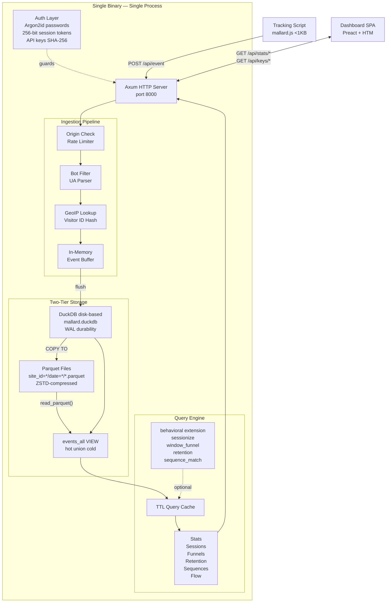
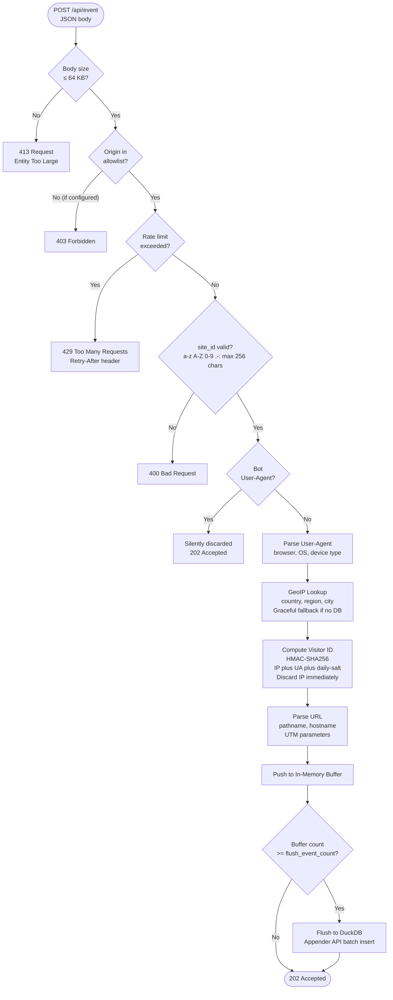
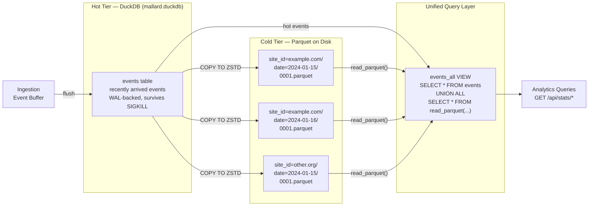
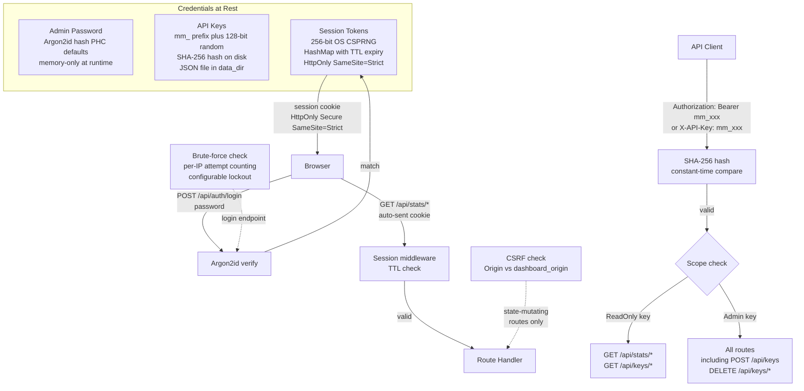
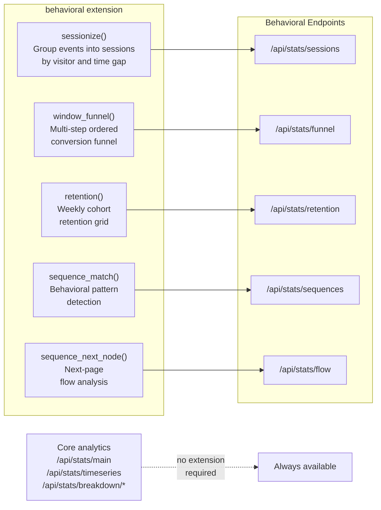

# Architecture

## Overview

Mallard Metrics is a single Rust binary that handles the complete analytics lifecycle: event ingestion, storage, querying, authentication, and dashboard serving. There are no external services, no message queues, and no separate database process.



---

## Event Ingestion Pipeline

Every `POST /api/event` request passes through a sequential pipeline of validation and enrichment steps before being buffered.



---

## Two-Tier Storage Model

Mallard Metrics stores events in two complementary tiers, always queried together via the `events_all` VIEW.



**Hot tier** (`data/mallard.duckdb`): Stores events that have been buffered but not yet flushed. Events here are immediately queryable. The DuckDB WAL provides durability — hot events survive a `SIGKILL` (crash), not just a graceful `SIGTERM`.

**Cold tier** (`.parquet` files): After flushing, events are written as ZSTD-compressed Parquet files partitioned by site and date. These files are the primary durability layer for historical data and can be queried independently with any Parquet-compatible tool (DuckDB CLI, pandas, Apache Spark).

**The `events_all` VIEW** is created at startup and refreshed after each flush. It transparently unions the hot and cold tiers so all analytics queries work correctly regardless of which tier the data resides in.

The cold-tier directory layout:

```
data/events/
├── site_id=example.com/
│   ├── date=2024-01-15/
│   │   ├── 0001.parquet
│   │   └── 0002.parquet
│   └── date=2024-01-16/
│       └── 0001.parquet
└── site_id=other-site.org/
    └── date=2024-01-15/
        └── 0001.parquet
```

---

## Authentication Architecture



### Key Security Properties

| Property | Implementation |
|---|---|
| Password storage | Argon2id hash (PHC defaults), never stored in plaintext |
| Session tokens | 256-bit OS CSPRNG; `HashMap` with TTL; cleared on restart |
| API key storage | SHA-256 hash on disk; plaintext returned only at creation |
| Timing attacks | Constant-time comparison for API key validation |
| Session cookies | `HttpOnly; Secure; SameSite=Strict` |
| CSRF | Origin/Referer validation on all state-mutating session-auth routes |
| Brute force | Per-IP attempt counting; configurable lockout and `Retry-After` |

---

## Behavioral Extension

Advanced analytics rely on the DuckDB [`behavioral` extension](https://github.com/tomtom215/duckdb-behavioral), which provides window aggregate functions purpose-built for clickstream analysis.



The extension is loaded at startup:

```sql
INSTALL behavioral FROM community;
LOAD behavioral;
```

If loading fails (network unavailable, air-gapped environment), all extension-dependent endpoints return **graceful defaults** (zeroes or empty arrays). Core analytics continue working normally. The `GET /health/detailed` JSON response and `GET /metrics` Prometheus output both report whether the extension loaded successfully.

---

## Module Map

| Module | Purpose |
|---|---|
| `config.rs` | TOML + environment variable configuration |
| `server.rs` | Axum router with CORS configuration and middleware stack |
| `ingest/handler.rs` | `POST /api/event` ingestion handler |
| `ingest/buffer.rs` | In-memory event buffer with periodic flush |
| `ingest/visitor_id.rs` | HMAC-SHA256 privacy-safe visitor ID |
| `ingest/useragent.rs` | User-Agent parsing |
| `ingest/geoip.rs` | MaxMind GeoIP reader with graceful fallback |
| `ingest/ratelimit.rs` | Per-site token-bucket rate limiter |
| `storage/schema.rs` | DuckDB table definitions and `events_all` view |
| `storage/parquet.rs` | Parquet write/read/partitioning |
| `storage/migrations.rs` | Schema versioning |
| `query/metrics.rs` | Core metric calculations |
| `query/breakdowns.rs` | Dimension breakdown queries |
| `query/timeseries.rs` | Time-bucketed aggregations |
| `query/sessions.rs` | `sessionize`-based session queries |
| `query/funnel.rs` | `window_funnel` query builder |
| `query/retention.rs` | Retention cohort query execution |
| `query/sequences.rs` | `sequence_match` query execution |
| `query/flow.rs` | `sequence_next_node` flow analysis |
| `query/cache.rs` | TTL-based query result cache |
| `api/stats.rs` | All analytics API handlers |
| `api/errors.rs` | API error types |
| `api/auth.rs` | Origin validation, session auth, API key management |
| `dashboard/` | Embedded SPA (Preact + HTM) |
