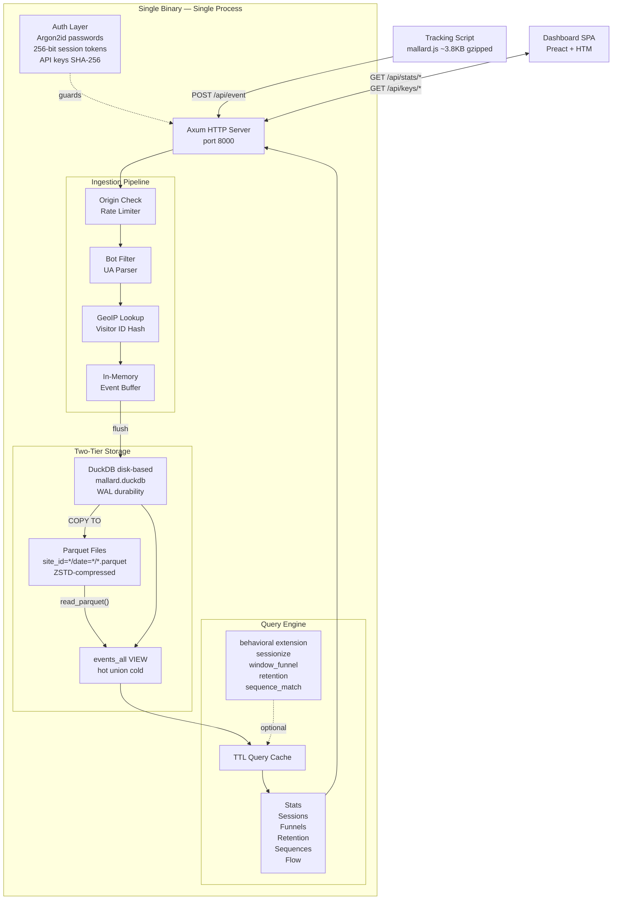
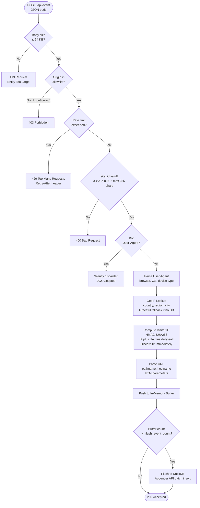
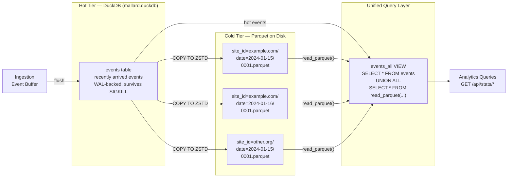
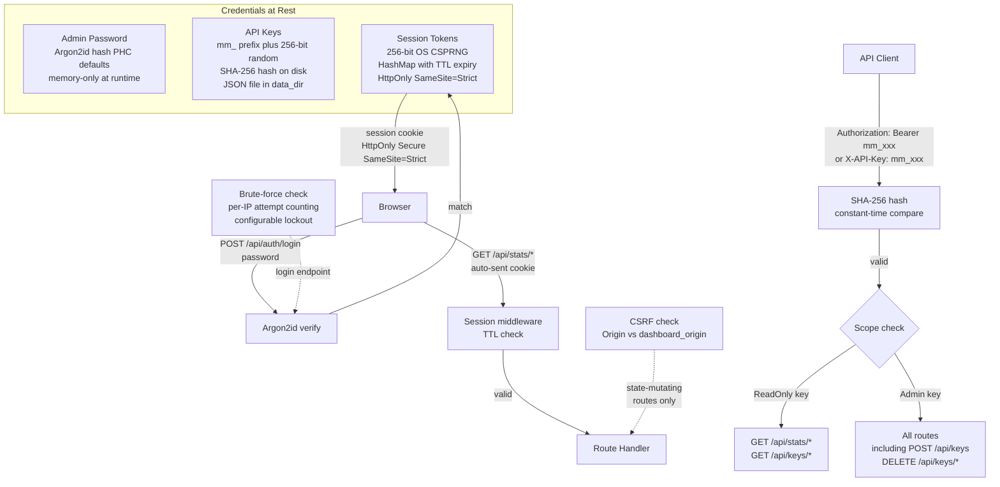
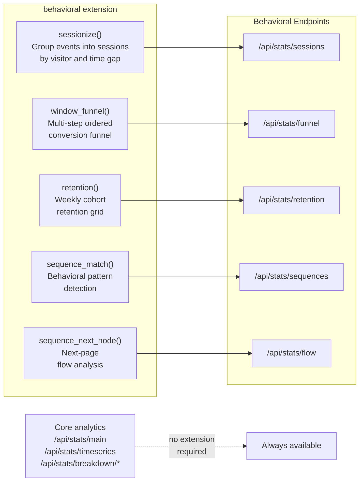

# Architecture

## Overview

Mallard Metrics is a single Rust binary that handles the complete analytics lifecycle: event ingestion, storage, querying, authentication, and dashboard serving. There are no external services, no message queues, and no separate database process.


```mermaid
flowchart TD
    TS["Tracking Script\nmallard.js ~3.8KB gzipped"]
    DASH["Dashboard SPA\nPreact + HTM"]

    TS -->|"POST /api/event"| AXUM
    DASH <-->|"GET /api/stats/*\nGET /api/keys/*"| AXUM

    subgraph BINARY["Single Binary — Single Process"]
        AXUM["Axum HTTP Server\nport 8000"]

        subgraph INGEST["Ingestion Pipeline"]
            direction LR
            OC["Origin Check\nRate Limiter"] --> BF["Bot Filter\nUA Parser"]
            BF --> GEO["GeoIP Lookup\nVisitor ID Hash"]
            GEO --> BUF["In-Memory\nEvent Buffer"]
        end

        subgraph STORE["Two-Tier Storage"]
            direction LR
            DB["DuckDB disk-based\nmallard.duckdb\nWAL durability"]
            PQ["Parquet Files\nsite_id=*/date=*/*.parquet\nZSTD-compressed"]
            VIEW["events_all VIEW\nhot union cold"]
            DB -->|"COPY TO"| PQ
            DB --> VIEW
            PQ -->|"read_parquet()"| VIEW
        end

        subgraph QUERY["Query Engine"]
            direction LR
            CACHE["TTL Query Cache"] --> QH["Stats\nSessions\nFunnels\nRetention\nSequences\nFlow"]
            EXT["behavioral extension\nsessionize\nwindow_funnel\nretention\nsequence_match"] -.->|"optional"| CACHE
        end

        AUTH["Auth Layer\nArgon2id passwords\n256-bit session tokens\nAPI keys SHA-256"] -.->|"guards"| AXUM

        AXUM --> OC
        BUF -->|"flush"| DB
        VIEW --> CACHE
        QH --> AXUM
    end
```

---

## Event Ingestion Pipeline

Every `POST /api/event` request passes through a sequential pipeline of validation and enrichment steps before being buffered.


```mermaid
flowchart TD
    START(["POST /api/event\nJSON body"])

    START --> SZ{"Body size\n&le; 64 KB?"}
    SZ -->|"No"| R413["413 Request\nEntity Too Large"]
    SZ -->|"Yes"| OC

    OC{"Origin in\nallowlist?"}
    OC -->|"No (if configured)"| R403["403 Forbidden"]
    OC -->|"Yes"| RL

    RL{"Rate limit\nexceeded?"}
    RL -->|"Yes"| R429["429 Too Many Requests\nRetry-After header"]
    RL -->|"No"| SITEID

    SITEID{"site_id valid?\na-z A-Z 0-9 .-: max 256 chars"}
    SITEID -->|"No"| R400["400 Bad Request"]
    SITEID -->|"Yes"| BOT

    BOT{"Bot\nUser-Agent?"}
    BOT -->|"Yes"| DISCARD["Silently discarded\n202 Accepted"]
    BOT -->|"No"| UA

    UA["Parse User-Agent\nbrowser, OS, device type"]
    UA --> GEO

    GEO["GeoIP Lookup\ncountry, region, city\nGraceful fallback if no DB"]
    GEO --> VID

    VID["Compute Visitor ID\nHMAC-SHA256\nIP plus UA plus daily-salt\nDiscard IP immediately"]
    VID --> URL

    URL["Parse URL\npathname, hostname\nUTM parameters"]
    URL --> BUF

    BUF["Push to In-Memory Buffer"]
    BUF --> THR{"Buffer count\n>= flush_event_count?"}
    THR -->|"Yes"| FLUSH["Flush to DuckDB\nAppender API batch insert"]
    THR -->|"No"| R202
    FLUSH --> R202

    R202(["202 Accepted"])
```

---

## Two-Tier Storage Model

Mallard Metrics stores events in two complementary tiers, always queried together via the `events_all` VIEW.


```mermaid
flowchart LR
    INGEST["Ingestion\nEvent Buffer"]

    subgraph HOT["Hot Tier — DuckDB (mallard.duckdb)"]
        EVENTS["events table\nrecently arrived events\nWAL-backed, survives SIGKILL"]
    end

    subgraph COLD["Cold Tier — Parquet on Disk"]
        P1["site_id=example.com/\ndate=2024-01-15/\n0001.parquet"]
        P2["site_id=example.com/\ndate=2024-01-16/\n0001.parquet"]
        P3["site_id=other.org/\ndate=2024-01-15/\n0001.parquet"]
    end

    subgraph UNIFIED["Unified Query Layer"]
        VIEW["events_all VIEW\nSELECT * FROM events\nUNION ALL\nSELECT * FROM read_parquet(...)"]
    end

    INGEST -->|"flush"| EVENTS
    EVENTS -->|"COPY TO ZSTD"| P1
    EVENTS -->|"COPY TO ZSTD"| P2
    EVENTS -->|"COPY TO ZSTD"| P3
    EVENTS -->|"hot events"| VIEW
    P1 -->|"read_parquet()"| VIEW
    P2 -->|"read_parquet()"| VIEW
    P3 -->|"read_parquet()"| VIEW
    VIEW --> ANALYTICS["Analytics Queries\nGET /api/stats/*"]
```

**Hot tier** (`data/mallard.duckdb`): Stores events that have been buffered but not yet flushed. Events here are immediately queryable. The DuckDB WAL provides durability — hot events survive a `SIGKILL` (crash), not just a graceful `SIGTERM`.

**Cold tier** (`.parquet` files): After flushing, events are written as ZSTD-compressed Parquet files partitioned by site and date. These files are the primary durability layer for historical data and can be queried independently with any Parquet-compatible tool (DuckDB CLI, pandas, Apache Spark).

Each file is written under a temporary `.parquet.tmp` name and renamed into
place, and the read glob only matches `*.parquet`. A crash or a full disk
mid-write therefore leaves a partial file that no query can see, rather than a
truncated file that blocks every read of that partition. Any temporary files
left by an earlier crash are swept at startup.

**Compaction.** A 60-second flush interval writes about 1,440 files per site per
day, and DuckDB reads the footer of every matching file on every query — so scan
cost would grow with uptime. Once a partition holds more than
`compact_after_files` files they are merged into one, again through a temporary
file and a rename, so an interruption leaves either the old files or the new one
and never neither.

**The `events_all` VIEW** is created at startup and refreshed after each flush
that wrote files. It transparently unions the hot and cold tiers so all
analytics queries work correctly regardless of which tier the data resides in.
DuckDB connections opened against one database share a catalog, so refreshing it
on the writer connection is enough for the whole read pool.

The cold-tier directory layout:

```
data/events/
├── site_id=example.com/
│   ├── date=2024-01-15/
│   │   ├── 0001.parquet
│   │   └── 0002.parquet
│   └── date=2024-01-16/
│       └── 0001.parquet
└── site_id=other-site.org/
    └── date=2024-01-15/
        └── 0001.parquet
```

---

## Authentication Architecture


```mermaid
flowchart TD
    subgraph CREDS["Credentials at Rest"]
        HASH["Admin Password\nArgon2id hash PHC defaults\nmemory-only at runtime"]
        KEYS["API Keys\nmm_ prefix plus 256-bit random\nSHA-256 hash on disk\nJSON file in data_dir"]
        SESS["Session Tokens\n256-bit OS CSPRNG\nHashMap with TTL expiry\nHttpOnly SameSite=Strict"]
    end

    BROWSER["Browser"] -->|"POST /api/auth/login\npassword"| ARGON
    ARGON["Argon2id verify"] -->|"match"| SESS
    SESS -->|"session cookie\nHttpOnly Secure SameSite=Strict"| BROWSER

    APICLIENT["API Client"] -->|"Authorization: Bearer mm_xxx\nor X-API-Key: mm_xxx"| KEYCHECK
    KEYCHECK["SHA-256 hash\nconstant-time compare"] -->|"valid"| SCOPE

    SCOPE{"Scope check"}
    SCOPE -->|"ReadOnly key"| READONLY["GET /api/stats/*\nGET /api/keys/*"]
    SCOPE -->|"Admin key"| ADMIN["All routes\nincluding POST /api/keys\nDELETE /api/keys/*"]

    BROWSER -->|"GET /api/stats/*\nauto-sent cookie"| SESSMW
    SESSMW["Session middleware\nTTL check"] -->|"valid"| ROUTE

    ROUTE["Route Handler"]

    CSRF["CSRF check\nOrigin vs dashboard_origin"] -.->|"state-mutating\nroutes only"| ROUTE
    BF["Brute-force check\nper-IP attempt counting\nconfigurable lockout"] -.->|"login endpoint"| ARGON
```

### Key Security Properties

| Property | Implementation |
|---|---|
| Password storage | Argon2id hash (PHC defaults), never stored in plaintext |
| Session tokens | 256-bit OS CSPRNG; `HashMap` with TTL; cleared on restart |
| API key storage | SHA-256 hash on disk; plaintext returned only at creation |
| Timing attacks | Constant-time comparison for API key validation |
| Session cookies | `HttpOnly; Secure; SameSite=Strict` |
| CSRF | Origin/Referer validation on all state-mutating session-auth routes |
| Brute force | Per-IP attempt counting; configurable lockout and `Retry-After` |

---

## Behavioral Extension

Advanced analytics rely on the DuckDB [`behavioral` extension](https://github.com/tomtom215/duckdb-behavioral), which provides window aggregate functions purpose-built for clickstream analysis.


```mermaid
flowchart LR
    subgraph EXT["behavioral extension"]
        SESS_F["sessionize()\nGroup events into sessions\nby visitor and time gap"]
        FUNNEL_F["window_funnel()\nMulti-step ordered\nconversion funnel"]
        RET_F["retention()\nWeekly cohort\nretention grid"]
        SEQ_F["sequence_match()\nBehavioral pattern\ndetection"]
        FLOW_F["sequence_next_node()\nNext-page\nflow analysis"]
    end

    subgraph API["Behavioral Endpoints"]
        direction TB
        S["/api/stats/sessions"]
        FU["/api/stats/funnel"]
        R["/api/stats/retention"]
        SQ["/api/stats/sequences"]
        FL["/api/stats/flow"]
    end

    SESS_F --> S
    FUNNEL_F --> FU
    RET_F --> R
    SEQ_F --> SQ
    FLOW_F --> FL

    CORE["Core analytics\n/api/stats/main\n/api/stats/timeseries\n/api/stats/breakdown/*"] -.->|"no extension\nrequired"| ALWAYS["Always available"]
```

The extension is loaded at startup:

```sql
INSTALL behavioral FROM community;
LOAD behavioral;
```

If loading fails — no network on first run, or an air-gapped environment — the
extension-dependent endpoints return **`503` with an explanation** and
`/api/stats/main` reports its session-derived fields as `null`. They deliberately
do not return zeros: a flat `0.0` bounce rate is indistinguishable from a site
where every visitor bounces, so a missing dependency would look like a finding.

Core analytics — visitors, pageviews, breakdowns, time series, goals, revenue and
custom properties — continue working. `GET /health/detailed` reports both
`behavioral_extension_loaded` and `behavioral_version`, and `GET /metrics`
exposes the `mallard_behavioral_extension` gauge.

---

## Module Map

| Module | Purpose |
|---|---|
| `lib.rs` | Library root; the binary is a thin wrapper over it |
| `main.rs` | Startup, background tasks, `--healthcheck`, graceful shutdown |
| `config.rs` | TOML + environment variable configuration, validation, advisories |
| `server.rs` | Axum router, CORS, middleware stack, `/metrics`, health probes |
| `test_support.rs` | `AppState` builder shared by unit and integration tests |
| `ingest/handler.rs` | `POST /api/event` and the `GET` pixel; shared event construction |
| `ingest/buffer.rs` | Bounded in-memory event buffer with periodic flush |
| `ingest/visitor_id.rs` | HMAC-SHA256 visitor ID and epoch-aligned salt rotation |
| `ingest/useragent.rs` | User-Agent and Client Hints parsing |
| `ingest/geoip.rs` | MaxMind GeoIP reader with graceful fallback |
| `ingest/ratelimit.rs` | Per-site and per-IP token-bucket rate limiters |
| `storage/mod.rs` | `ReaderPool` — round-robin read connections |
| `storage/schema.rs` | DuckDB table definitions and the `events_all` view |
| `storage/parquet.rs` | Atomic Parquet writes, compaction, retention, erasure |
| `storage/migrations.rs` | Schema versioning |
| `query/mod.rs` | `QueryScope` — the site, range and session window every query shares |
| `query/metrics.rs` | Core metrics, including `sessionize`-derived session metrics |
| `query/breakdowns.rs` | Dimension breakdown queries |
| `query/timeseries.rs` | Gap-filled time-bucketed aggregations |
| `query/realtime.rs` | Last-N-minutes activity snapshot |
| `query/funnel.rs` | `window_funnel` cumulative funnels with ordering modes |
| `query/retention.rs` | Per-visitor weekly retention cohorts |
| `query/sequences.rs` | `sequence_match` / `sequence_count` execution |
| `query/flow.rs` | `sequence_next_node` forward and backward flow analysis |
| `query/events.rs` | Goal conversions and custom property keys and values |
| `query/revenue.rs` | Per-currency revenue totals |
| `query/export.rs` | Daily and raw event export as CSV or JSON |
| `query/cache.rs` | TTL + LRU query result cache |
| `query/test_support.rs` | `TestDb` — a seeded database for query tests |
| `api/stats.rs` | All analytics API handlers |
| `api/errors.rs` | API error types, including the 503 for a missing extension |
| `api/auth.rs` | Origin validation, session auth, API key management |
| `dashboard/` | Embedded SPA (Preact + HTM, no build step) |
| `tracking/script.js` | The tracking script, compiled into the binary |

`query/sessions.rs` no longer exists: computing session metrics separately meant
scanning the events twice for one dashboard panel, so it was folded into
`query/metrics.rs`.
