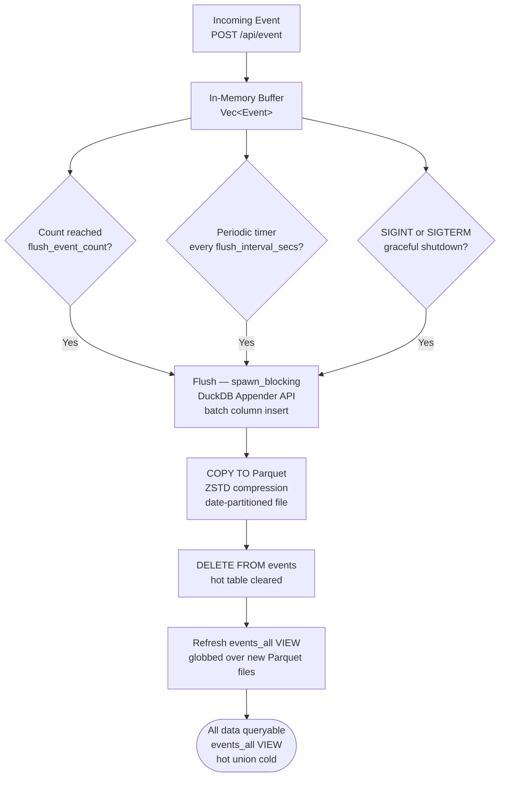

# Data Management

## Storage Layout

Events are stored as date-partitioned, ZSTD-compressed Parquet files under `data_dir/events/`:

```
data/events/
├── site_id=example.com/
│   ├── date=2024-01-15/
│   │   ├── 0001.parquet   ← first flush for this day
│   │   └── 0002.parquet   ← second flush for this day
│   └── date=2024-01-16/
│       └── 0001.parquet
└── site_id=other.org/
    └── date=2024-01-15/
        └── 0001.parquet
```

Each Parquet file contains one batch of flushed events for a specific site and date. Files are numbered sequentially within each partition. Parquet files are self-describing and can be read by any Parquet-compatible tool.

---

## Buffer and Flush Lifecycle



> **Failure safety:** If the Appender insertion fails, drained events are restored to the front of the buffer and the flush returns an error. No events are lost due to a failed flush attempt.

**Flush triggers:**

1. Event count reaches `flush_event_count` (default 1000).
2. Periodic timer fires every `flush_interval_secs` (default 60 seconds). Runs in `spawn_blocking` to avoid blocking the async runtime.
3. Graceful shutdown — bounded by `shutdown_timeout_secs` (default 30 seconds).

---

## Data Retention

When `retention_days` is set to a non-zero value, a background task runs daily and removes Parquet partition directories older than the configured threshold.

```toml
# Delete partitions older than 90 days
retention_days = 90
```

**What is deleted:** the entire `date=YYYY-MM-DD/` directory and all Parquet files within it.

**What is not deleted:** the `site_id=*/` parent directory (it remains even if all date partitions have been removed).

To keep data indefinitely, set `retention_days = 0` (the default).

### GDPR Right to Erasure

Mallard Metrics provides an admin-authenticated `DELETE /api/gdpr/erase` endpoint to permanently delete analytics data for a given `site_id` within a date range. Because visitor IDs are pseudonymous daily-rotating HMAC hashes that cannot be reverse-mapped to individuals, erasure operates at the **site + date-range** granularity — the finest granularity available without the original IP address and User-Agent. See [PRIVACY.md](../../../PRIVACY.md) for the full analysis and operator obligations.

---

## Backup and Restore

Parquet files are self-describing and portable. To back up:

```bash
# Sync data directory to a backup location
rsync -a --checksum /data/events/ /backup/mallard-events/

# Or with rclone to S3
rclone sync /data/events s3:my-bucket/mallard-events
```

To restore:

```bash
rsync -a /backup/mallard-events/ /data/events/
```

After restore, restart Mallard Metrics. The `events_all` VIEW automatically picks up all Parquet files on startup.

> **Tip:** Include `data/mallard.duckdb` and `data/mallard.duckdb.wal` in your backups to preserve any hot (not yet flushed) events.

---

## Inspecting Data with DuckDB CLI

You can query Parquet files directly with the DuckDB CLI, independent of the Mallard Metrics server:

```bash
duckdb

-- Daily visitor and pageview counts for a site
SELECT
    CAST(timestamp AS DATE) AS date,
    COUNT(DISTINCT visitor_id)                            AS visitors,
    COUNT(*) FILTER (WHERE event_name = 'pageview')       AS pageviews
FROM read_parquet('data/events/site_id=example.com/**/*.parquet')
GROUP BY date
ORDER BY date DESC;

-- Top pages last 30 days
SELECT pathname, COUNT(*) AS views
FROM read_parquet('data/events/site_id=example.com/**/*.parquet')
WHERE event_name = 'pageview'
  AND CAST(timestamp AS DATE) >= CURRENT_DATE - INTERVAL 30 DAYS
GROUP BY pathname
ORDER BY views DESC
LIMIT 20;

-- Revenue by product
SELECT
    json_extract_string(props, '$.product') AS product,
    SUM(revenue_amount)                      AS total_revenue,
    COUNT(*)                                 AS transactions
FROM read_parquet('data/events/site_id=example.com/**/*.parquet')
WHERE event_name = 'purchase'
GROUP BY product
ORDER BY total_revenue DESC;
```

---

## Schema

The events table schema (also the Parquet file schema):

| Column | Type | Nullable | Description |
|---|---|---|---|
| `site_id` | VARCHAR | No | Site identifier |
| `visitor_id` | VARCHAR | No | HMAC-SHA256 privacy-safe visitor ID |
| `timestamp` | TIMESTAMP | No | UTC event timestamp |
| `event_name` | VARCHAR | No | Event type (e.g. `pageview`, `signup`) |
| `pathname` | VARCHAR | No | URL path |
| `hostname` | VARCHAR | Yes | URL hostname |
| `referrer` | VARCHAR | Yes | Referrer URL |
| `referrer_source` | VARCHAR | Yes | Parsed referrer source name |
| `utm_source` | VARCHAR | Yes | UTM source parameter |
| `utm_medium` | VARCHAR | Yes | UTM medium parameter |
| `utm_campaign` | VARCHAR | Yes | UTM campaign parameter |
| `utm_content` | VARCHAR | Yes | UTM content parameter |
| `utm_term` | VARCHAR | Yes | UTM term parameter |
| `browser` | VARCHAR | Yes | Browser name |
| `browser_version` | VARCHAR | Yes | Browser version string |
| `os` | VARCHAR | Yes | Operating system name |
| `os_version` | VARCHAR | Yes | OS version string |
| `device_type` | VARCHAR | Yes | `desktop`, `mobile`, or `tablet` |
| `screen_size` | VARCHAR | Yes | Screen dimensions (e.g. `1920x1080`) |
| `country_code` | VARCHAR(2) | Yes | ISO 3166-1 alpha-2 country code |
| `region` | VARCHAR | Yes | Region/state name |
| `city` | VARCHAR | Yes | City name |
| `props` | VARCHAR | Yes | Custom properties (JSON string, queryable via `json_extract`) |
| `revenue_amount` | DECIMAL(12,2) | Yes | Revenue amount |
| `revenue_currency` | VARCHAR(3) | Yes | ISO 4217 currency code |
