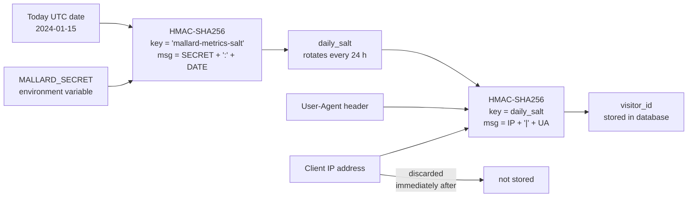

# Security & Privacy

## Privacy Model

Mallard Metrics is built with privacy as a hard constraint, not an afterthought.

### No Cookies

The tracking script sets no cookies. There is no cookie-based session tracking of any kind.

### No PII Storage

The client IP address is the only potentially identifying value that reaches the server. It is:

1. Used to compute the visitor ID (see below).
2. Used for a GeoIP lookup (if configured).
3. **Discarded immediately.** It is never written to the database, log files, or Parquet files.

No names, email addresses, or device fingerprints are collected or stored.

### Privacy-Safe Visitor ID

To count unique visitors without storing PII, Mallard Metrics uses a two-step HMAC-SHA256 derivation:



Properties of this approach:

- **Deterministic within a day** — The same visitor from the same browser produces the same ID throughout the day, enabling accurate unique-visitor counts.
- **Rotates daily** — The UTC date rotates the effective key every 24 hours, so IDs cannot be correlated across days.
- **Not reversible** — Without `MALLARD_SECRET`, the IP address cannot be recovered from the stored hash.
- **No IP storage** — The IP address is discarded immediately after hashing.

### GDPR/CCPA Compliance

Mallard Metrics stores pseudonymous visitor IDs (daily-rotating HMAC-SHA256 hashes), which are personal data under GDPR Recital 26. Operators must establish a lawful basis for processing — typically Art. 6(1)(f) legitimate interests for aggregate analytics, especially when combined with [GDPR mode](../deployment.md#gdpr-friendly-deployment). See [PRIVACY.md](../../../PRIVACY.md) for the full legal analysis, DPIA guidance, and operator obligations.

Key points:
- **No cookies are set** for tracking — no ePrivacy consent banner is needed for the tracking script itself.
- **Data subject erasure** is supported via `DELETE /api/gdpr/erase` (Admin API key required).
- **No third-party data sharing** — all processing is first-party, no data processor agreements needed.

---

## Authentication Security

### Dashboard Password

Passwords are hashed with **Argon2id** using PHC default parameters before any comparison. The plaintext password is never stored. The hash is held in memory and loaded from the `MALLARD_ADMIN_PASSWORD` environment variable at startup.

### Session Tokens

Dashboard sessions use **256-bit cryptographically random tokens** generated with the OS CSPRNG. Tokens are delivered as `HttpOnly; SameSite=Strict` cookies to prevent JavaScript access and CSRF.

Sessions are stored in an in-memory `HashMap` with TTL expiry (default 24 hours, configurable via `session_ttl_secs`). Sessions are cleared on server restart.

When `MALLARD_SECURE_COOKIES=true` is set (required when behind a TLS reverse proxy), the `Secure` flag is added to the cookie, preventing transmission over plain HTTP.

### API Keys

| Property | Value |
|---|---|
| Entropy | 128 bits of randomness |
| Prefix | `mm_` — easy to identify in logs and secret scanners |
| Storage | SHA-256 hash stored in a JSON file in `data_dir/`. Plaintext returned only at creation. |
| Comparison | Constant-time equality to prevent timing side-channel attacks |
| Scopes | `ReadOnly` (GET stats only) or `Admin` (full access including key management) |
| Persistence | Disk-persisted; survive server restarts |

---

## Input Validation and SQL Injection Prevention

### Parameterized Queries

All user-supplied values (site IDs, date ranges, event names) are bound to SQL statements as parameters using DuckDB's prepared statement API. Raw string interpolation is used only where DuckDB's API does not support parameters (e.g., `COPY TO` file paths), and those values are explicitly validated and escaped before use.

### Path Traversal Prevention

The `site_id` value is validated by `is_safe_path_component()` before being used in any filesystem path. The following are rejected:

- Empty strings
- Strings containing `..` (directory traversal)
- Strings containing `/` or `\` (path separators)
- Strings containing null bytes (`\0`)
- Strings longer than 256 characters
- Characters outside `[a-zA-Z0-9._\-:]`

### Funnel and Sequence Step Validation

User-supplied funnel and sequence steps (from `?steps=` query parameters) are parsed from a safe `page:/path` or `event:name` format. Raw SQL expressions are never accepted from the API. Single quotes in path values are escaped by doubling.

### Date Range Validation

The `start_date` and `end_date` parameters are validated as `YYYY-MM-DD` format, checked for logical consistency (`end >= start`), and capped at a maximum 366-day span.

### Breakdown Limit

The `limit` parameter for breakdown queries is capped at 1000 to prevent unbounded result sets.

### Origin Validation

When `site_ids` is configured, the `Origin` header is validated with **exact host matching**:

- `https://example.com` → passes (if `"example.com"` is in `site_ids`).
- `http://example.com:8080` → passes (explicit port suffix allowed).
- `https://example.com.evil.com` → **rejected** (prefix match is explicitly disallowed).

### CSV Injection Prevention

The CSV export endpoint escapes fields starting with formula-triggering characters (`=`, `+`, `-`, `@`) by prefixing them with a single quote, preventing formula injection when the CSV is opened in spreadsheet software.

---

## Brute-Force Protection

Login attempts are tracked per client IP address. After `max_login_attempts` consecutive failures (default 5), the IP is locked out for `login_lockout_secs` seconds (default 300). The server returns `429 Too Many Requests` with a `Retry-After` header containing the remaining lockout duration.

A successful login clears the failure count for that IP. Failure counts are stored in memory and reset on server restart.

Configure via TOML fields `max_login_attempts` and `login_lockout_secs`, or the environment variables `MALLARD_MAX_LOGIN_ATTEMPTS` and `MALLARD_LOGIN_LOCKOUT`. Set `max_login_attempts = 0` to disable.

---

## Security Headers

All HTTP responses include these OWASP-recommended security headers:

| Header | Value | Purpose |
|---|---|---|
| `X-Content-Type-Options` | `nosniff` | Prevents MIME-type sniffing |
| `X-Frame-Options` | `DENY` | Prevents clickjacking via iframe embedding |
| `Referrer-Policy` | `strict-origin-when-cross-origin` | Limits referrer leakage |
| `Content-Security-Policy` | HTML responses only | Restricts scripts and resources to same origin |
| `Permissions-Policy` | `geolocation=(), microphone=(), camera=(), interest-cohort=()` | Disables browser feature APIs and FLoC/Topics |
| `Strict-Transport-Security` | `max-age=31536000; includeSubDomains; preload` | Instructs browsers to enforce HTTPS for 1 year; eligible for preload lists |
| `Cache-Control` | `no-store, no-cache` | JSON API responses only; prevents analytics data caching |
| `X-Request-ID` | UUID per request | Injected by the server, propagated through tracing spans for log correlation |

---

## HTTP Timeout

All requests have a 30-second server-side timeout. Connections that do not complete within this window are closed with `408 Request Timeout`. This prevents Slowloris-style attacks that hold connections open indefinitely.

---

## CSRF Protection

State-mutating endpoints authenticated via session cookie (login, logout, setup, key creation, key revocation) validate the `Origin` or `Referer` header against the configured `dashboard_origin`. Requests with a mismatched or missing origin receive `403 Forbidden`.

When `dashboard_origin` is not set, CSRF checks are bypassed (all origins allowed). **Set `dashboard_origin` in production** to enable CSRF protection.

---

## Network Security

### CORS Policy

Mallard Metrics uses separate CORS policies for ingestion and dashboard routes:

**Ingestion** (`POST /api/event`):
```
Access-Control-Allow-Origin: *
Access-Control-Allow-Methods: POST
```

**Dashboard / Stats / Admin** (when `dashboard_origin` is set):
```
Access-Control-Allow-Origin: <configured origin>
Access-Control-Allow-Methods: GET, POST, DELETE
Access-Control-Allow-Credentials: true
```

If `dashboard_origin` is not configured, the dashboard routes use a permissive policy that allows any origin (explicitly, not same-origin-only). Set `dashboard_origin` in production to restrict cross-origin access.

### TLS

Mallard Metrics does not handle TLS directly. In production, place it behind a TLS-terminating reverse proxy (nginx, Caddy, Traefik, etc.). Set `MALLARD_SECURE_COOKIES=true` once the proxy is in place.

### Request Concurrency

The four heavy behavioral analytics endpoints (`/api/stats/funnel`, `/api/stats/retention`, `/api/stats/sequences`, `/api/stats/flow`) are protected by a semaphore. The maximum number of concurrent heavy queries is configurable via `MALLARD_MAX_CONCURRENT_QUERIES` (default 10). Requests that exceed this limit receive `429 Too Many Requests` with a `Retry-After` header.

---

## Supply Chain

- All Rust dependencies are audited with `cargo-deny` in CI.
- GitHub Actions steps are pinned to exact commit SHAs (no floating version tags).
- The `bundled` DuckDB feature compiles DuckDB from source as part of the build; no pre-built DuckDB binaries are downloaded at runtime.
- `cargo build --locked` is used in CI to ensure reproducible builds from `Cargo.lock`.

---

## Threat Model Summary

| Threat | Mitigation |
|---|---|
| SQL injection | Parameterized queries throughout; `site_id` character validation |
| Path traversal | `is_safe_path_component()` on all filesystem paths |
| CSRF | Origin/Referer validation on state-mutating session-auth routes |
| Brute force (login) | Per-IP lockout, Argon2id hashing |
| Brute force (API) | Per-site rate limiting |
| Session hijacking | `HttpOnly; Secure; SameSite=Strict` cookies |
| Timing attacks | Constant-time comparison for API keys |
| Clickjacking | `X-Frame-Options: DENY` |
| Protocol downgrade | `Strict-Transport-Security` (HSTS, 1 year) |
| MIME sniffing | `X-Content-Type-Options: nosniff` |
| Data exfiltration | No outbound network calls; embedded DB; IP discarded after hash |
| PII leakage | IPs hashed then discarded; daily ID rotation; no cookies |
| CSV injection | Formula character escaping in export output |
| Dependency vulnerabilities | `cargo-deny` in CI; `Cargo.lock` committed and enforced |
